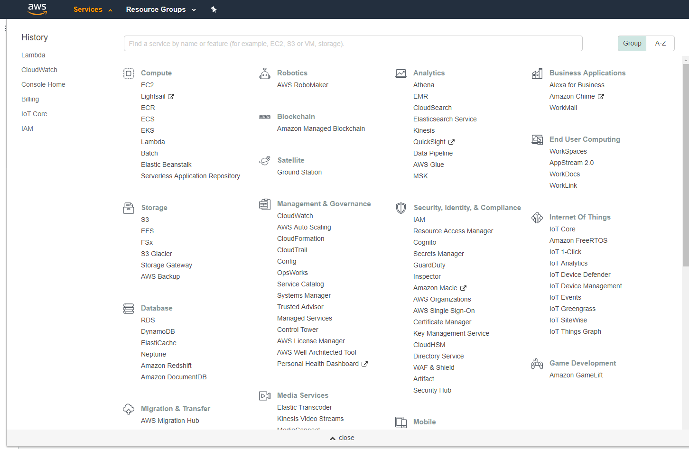
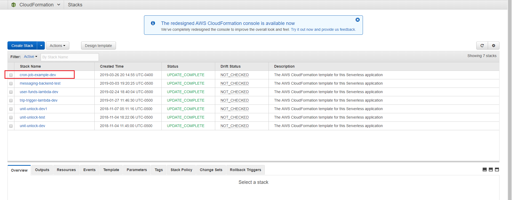
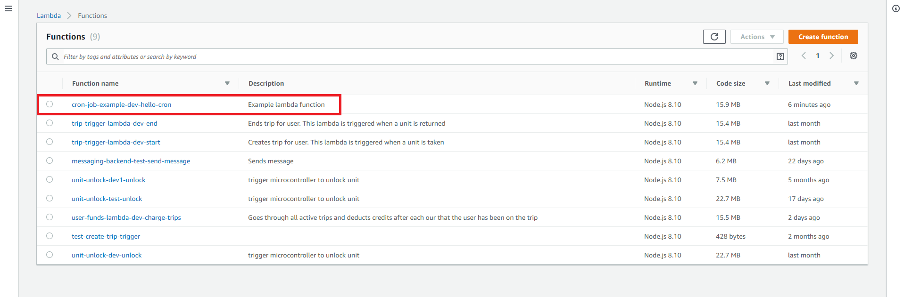
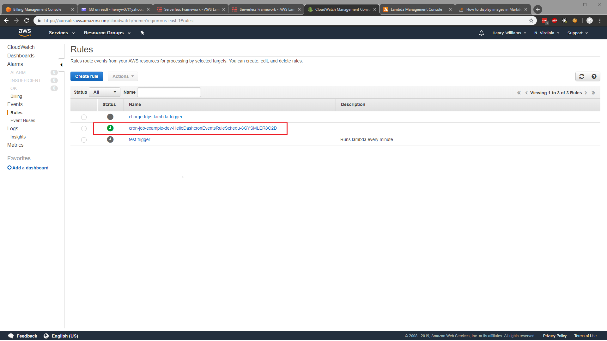
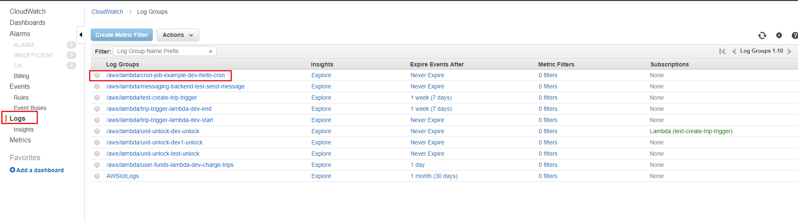
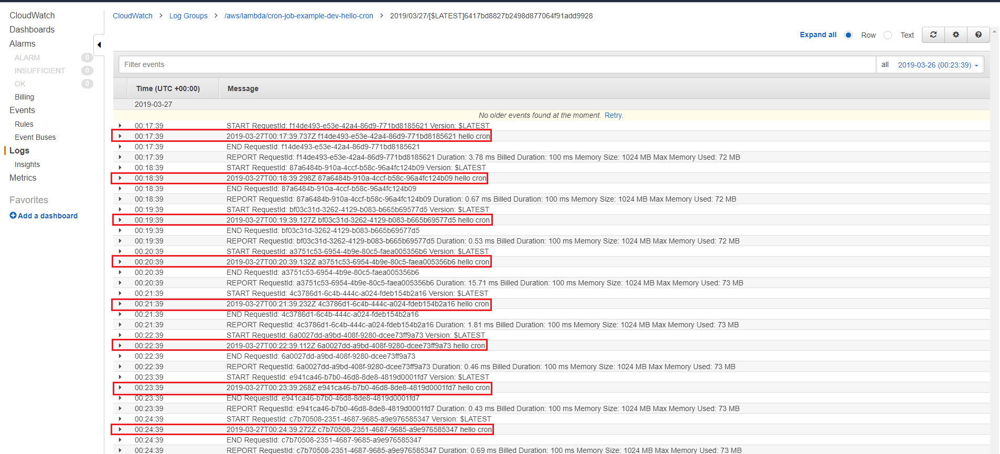

# Deploying
- Set up your AWS credentials in ~/.aws/credentials
    ```
    [serverless]
    aws_access_key_id = <access key>
    aws_secret_access_key = <secret access key>
    ```
- Run `npm install` to install the modules
- Run `npm run sls:deploy` to deploy
- Run `npm run sls:remove` to remove the stack

# Seeing what was deployed on AWS
- Look up service (e.g., CloudFormation, Lambda, etc.)

- CloudFormation stack

- Lambda function

- CloudWatch trigger

- CloudWatch logs



# Resources
- https://docs.aws.amazon.com/AmazonCloudWatch/latest/events/ScheduledEvents.html
- https://serverless.com/framework/docs/providers/aws/events/schedule/